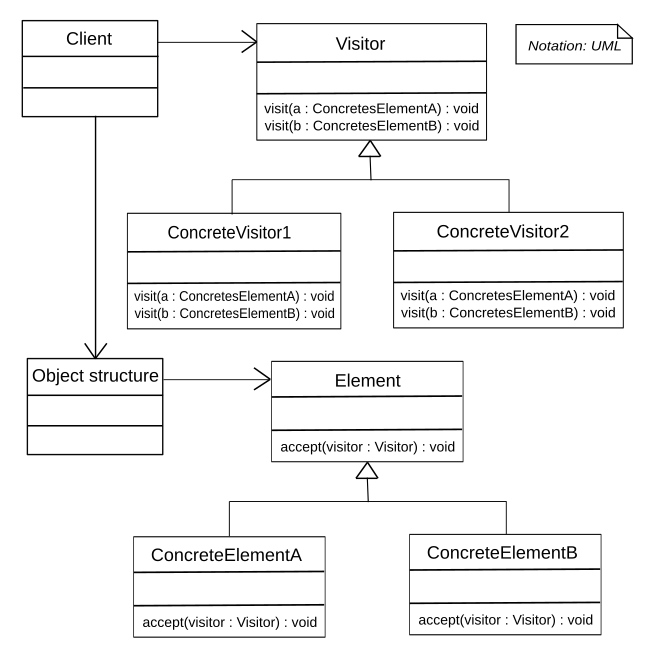

# Clase 9 
---
#### Aristas del paradigma orientado a objetos
- Polimosrfismo 
- Delegacion
- Encapsulamiento
        
#### Aristas del paradigma funcional 
- Orden superior
- Pureza -> Falta de efecto  y trasparencia referrencial

--- 
### Delegacion
* Es quien se encarga de las responsabilidades osea que objeto es el que se ecarga de ejutar sus metodos y dejar un estado consistente
  - En objetos siempre (Si esta bien codeado) va a dejar un estado cosistente 
  - En funcional puede quedan un estado inconsistente 

### Encapsulamiento 
* Que para accedera los objetos se debe acceder por medio de metodos y no desde los de la forma `alumno.nota = 7` en vez de `alumno.setnota(7)`
* Que un objeto conozca el mensaje de un objeto muy lejando por ejemplo `alumno.curso.docente.area.director.telefono.llamar()`
* La unica forma de romper este encapuslamiento y si usamos el **Polimorfismo Parametrico** 

### Polimorfismo 
* Que varios objetos heredan de una interfaz y comparten los metodos que heredan de a interfaz

*Nota:*
* A veces si sse quieren agregar metodos a una clase polimorfica se pueden implementar el **patron visitros** ya que sino es muy dificil mantenerlo. Pero... al quererlo implementar es un quilombo entonces termnando cayendo en el **Polimorfismo Parametrico** (Funcional) Con solo un `IF` ya podes arreglatelas pero... rompiendo el encapsulamiento

**Aveces es mejor romper las reglas**

---
## Patron Visitor
</img>

* Se utiliza para cuando queren en objetos aniadir un methodo en un polimorfismo    

*Nota:*
* Los visitors te permiten definir nuevas operacione sin cambiar las clases que lo implementa 
* El probleam es que al distribiur las oprecaoines entre disitnos nodos lleva a sistemas dificiles de **mantener** de **usar** y de **cambiar**.
* Se debe usar cuando
   * Una estructura de obejtos contiene muchas clases de objetos con disitnas interfaces y vos queres de la estrucutra que vos queres 
   * Hay muchas oprecaiones distitnas sin relacion entre ellas y no queres contaminar las interfaces usa un visitoros
   * Si tenes una estructura que va a cambiar mucho mas clases te combiene usar los metodos dentro de las clases. Pero si preeves que va a agregar mas metodos te conviene utilizar visitor. 

**ES UNA PORONGA EN CONCLUSION**

---